Lab: Automate business processes with Logic Apps

Student lab answer key

Exercise 1: Create Azure resources

Task 1: Open the Azure portal

1. On the     taskbar, select the **Microsoft Edge** icon.
2. In the     open browser window, go to the Azure portal ([https://portal.azure.com](https://portal.azure.com/)).
3. Enter     the email address for your Microsoft account, and then select **Next**.
4. Enter     the password for your Microsoft account, and then select **Sign in**.

**Note**: If this is your first time signing in to the Azure portal, you’ll be offered a tour of the portal. Select **Get Started** to skip the tour.

Task 2: Create an API Management resource

1. In the     Azure portal’s navigation pane, select **Create a resource**.
2. From     the **New** blade, find the **Search the Marketplace** text     box.
3. In the     search box, enter **API**, and then select Enter.
4. From     the **Marketplace** search results blade, select the **API     Management** result.
5. From     the **API Management** blade, select **Create**.
6. From     the **API Management Service** blade, perform the following     actions:

1. 1. In      the **Name** text box, enter **prodapim\*[yourname]\***.
   2. Leave      the **Subscription** text box set to its default value.
   3. In      the **Resource group** section, select **Create new**,      in the text box enter **AutomatedWorkflow**, and then      select **OK**.
   4. In      the **Location** list, select **East US**.
   5. In      the **Organization name** text box, enter **Contoso**.
   6. Leave      the **Administrator email** text box set to its default      value.
   7. In      the **Pricing tier** list, select **Consumption (99.9      SLA, %)**, and then select **Create**.

**Note**: Wait for Azure to finish creating the API Management resource prior to moving on in the lab. You will receive a notification when the resource is created.

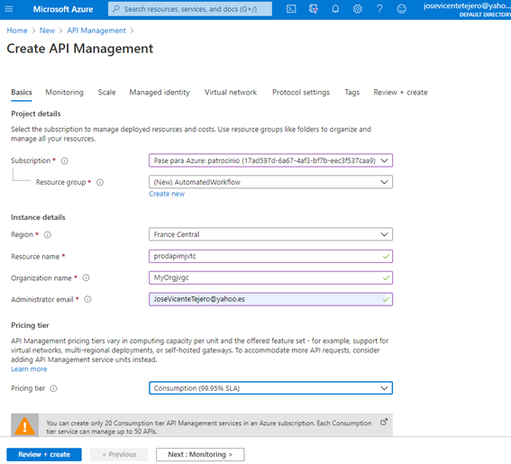 

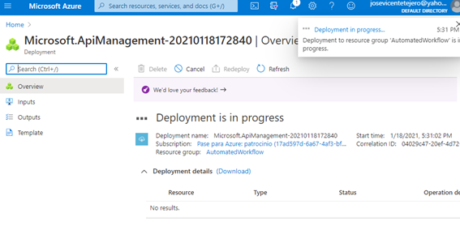

 

Task 3: Create a Logic App resource

1. In the     navigation pane of the Azure portal, select **+ Create a resource**.
2. On     the **New** blade, locate the **Search the Marketplace** field.
3. In the     search field, enter **Logic**, and then select Enter.
4. On     the **Everything** search results blade, select **Logic     App**.
5. On     the **Logic App** blade, select **Create**.
6. On     the **Logic App** blade, review the tabs on the blade, such     as **Basics**, **Tags**, and **Review + Create**.

**Note**: Each tab represents a step in the workflow to create a new logic app. You can select **Review + Create** at any time to skip the remaining tabs.

1. Select     the **Basics** tab, and then in the tab area, perform the     following actions:

1. 1. Leave      the **Subscription** field set to its default value.
   2. In      the **Resource group** list, select **Use existing**,      and then select the **AutomatedWorkflow** group you created      earlier in the lab.
   3. In      the **Logic App name** field, enter **prodflow\*[yourname]\***.
   4. In      the **Select the location** section, select **Region**.
   5. In      the **Location** list, select **East US**.
   6. In      the **Log Analytics** section, select **Off**.
   7. Select **Review      + Create**.

2. On the **Review     + Create** tab, review the options that you specified in the     previous steps.

3. Select **Create** to     create the logic app by using your specified configuration.

**Note**: Wait for Azure to finish creating the Logic Apps resource prior to moving on in the lab. You will receive a notification when the resource is created.

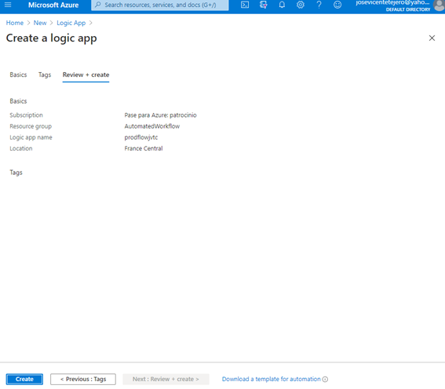

Task 4: Create a storage account

1. In the     Azure portal navigation pane, select **All services**.
2. On     the **All services** blade, select **Storage Accounts**.
3. On     the **Storage accounts** blade, get your list of storage     account instances, and then select **Add**.
4. On     the **Create storage account** blade, review the tabs on the     blade, such as **Basics**, **Tags**, and **Review +     Create**.

**Note**: Each tab represents a step in the workflow to create a new storage account. You can select **Review + Create** at any time to skip the remaining tabs.

1. Select     the **Basics** tab, and then in the tab area, perform the     following actions:

1. 1. Leave      the **Subscription** text box set to its default value.
   2. In      the **Resource group** section, select the **AutomatedWorkflow** group      you created earlier in the lab.
   3. In      the **Storage account name** text box, enter **prodstor\*[yourname]\***.
   4. In      the **Location** list, select the **(US) East US** region.
   5. In      the **Performance** section, select **Standard**.
   6. In      the **Account kind** list, select **StorageV2 (general      purpose v2)**.
   7. In      the **Replication** list, select **Locally-redundant      storage (LRS)**.
   8. In      the **Access tier (default)** section, ensure that **Hot** is      selected.
   9. Select **Review      + Create**.

2. On     the **Review + Create** tab, review the options that you specified     in the previous steps.

3. Select **Create** to     create the storage account by using your specified configuration.

**Note**: On the **Deployment** blade, wait for the creation task to complete before moving on in this lab.

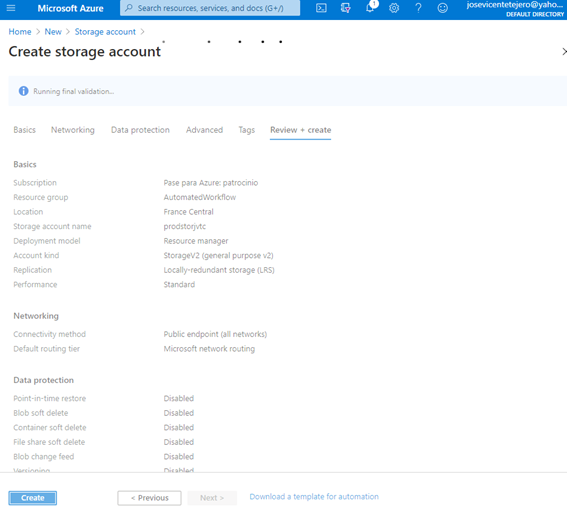

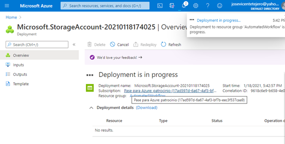

 

Task 5: Upload sample content to Azure Files

1. In the     Azure portal navigation pane, select the **Resource groups** link.
2. On     the **Resource groups** blade, find and then select the **AutomatedWorkflow** resource     group that you created earlier in this lab.
3. On     the **AutomatedWorkflow** blade, select the **prodstor\*[yourname]\*** storage     account that you created earlier in this lab.
4. On     the **Storage account** blade, in the **File service** section,     select the **File shares** link.
5. In     the **File shares** section, select **+ File share**.
6. In     the **File share** pop-up dialog box, perform the following     actions:

1. 1. In      the **Name** text box, enter **metadata**.
   2. In      the **Quota** text box, enter **1** (GiB).
   3. Select **Create**.

2. Back in     the **File shares** section, select the recently     created **metadata** share.

3. On     the **File share** blade, select **Upload**.

4. In     the **Upload files** dialog box, perform the following     actions:

1. 1. In      the **Files** section, select the **Folder** icon.

   2. In      the **File Explorer** window, browse to **Allfiles      (F):\Allfiles\Labs\09\Starter**, select the following files, and then      select **Open**:

   3. - **item_00.json**
      - **item_01.json**
      - **item_02.json**
      - **item_03.json**
      - **item_04.json**

   4. Ensure      that the **Overwrite if files already exist** check box is      selected, and then select **Upload**.

**Note**: Wait for the blob to upload before you continue with this lab.

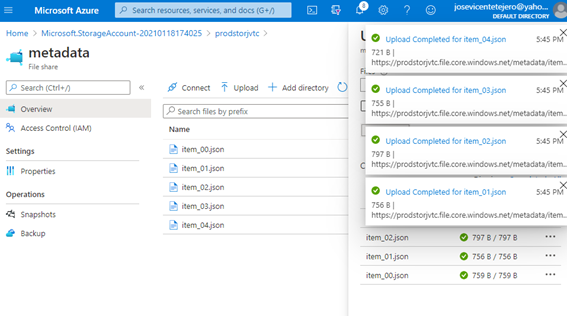

Review

In this exercise, you created all the resources that you’ll use for this lab.

Exercise 2: Implement a workflow using Logic Apps

Task 1: Create a trigger for the workflow

1. In the     Azure portal navigation pane, select **Resource groups**.
2. On     the **Resource groups** blade, select the **AutomatedWorkflow** resource     group that you created earlier in this lab.
3. On     the **AutomatedWorkflow** blade, select the **prodflow\*[yourname]\*** logic     app that you created earlier in this lab.
4. On     the **Logic Apps Designer** blade, select the **Blank     Logic App** template.
5. In     the **Designer** area, perform the following actions to add     a **When a HTTP request is received (Request)** trigger:

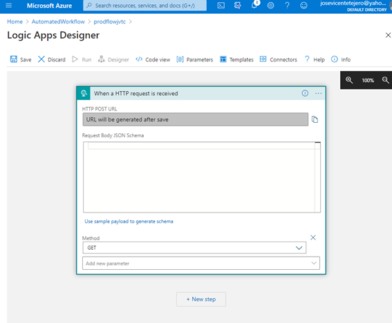

1. 1. In      the **Search connectors and triggers** field, enter **HTTP**.
   2. In the      category list, select **Request**.
   3. In      the **Triggers** result list, select **When a HTTP      request is received**.

2. In     the **When a HTTP request is received** area, perform the     following actions to configure the **When a HTTP request is received     (Request)** trigger:

1. 1. In      the **Add new parameter** list, select **Method**.
   2. In      the **Method** list, select **GET**.

Task 2: Create an action to query Azure Storage file shares

1. In     the **Designer** area, select **+ New step**, and     then perform the following actions to add a **List files (Azure File     Storage)** action:

1. 1. In      the **Search connectors and triggers** field, enter **files**.
   2. In the      category list, select **Azure File Storage**.
   3. In      the **Actions** result list, select **List files**.
   4. In      the **Connection Name** field, enter **filesConnection**.

2. 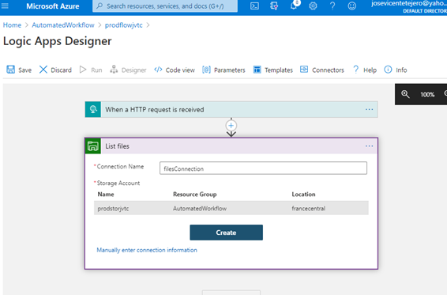

3. 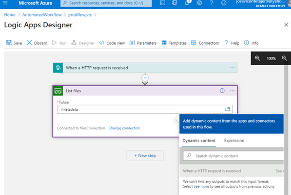

4. 1. In      the **Storage Account** section, select the **prodstor\*[yourname]\*** storage      account that you created earlier in this lab, and then select **Create**.
   2. Wait      for the connector resource to finish creating.

**Note**: These resources take one to five minutes to create.

1. In     the **List files** area, in the **Folder** text     box, enter **/metadata**.

Task 3: Create an action to project list item properties

1. In     the **Designer** area, select **+ New step**.
2. In     the **Designer** area, perform the following actions to add     an **Select (Data Operations)** action:

1. 1. In      the **Search connectors and triggers** field, enter **select**.
   2. In the      category list, select **Data Operations**.
   3. In      the **Actions** result list, select **Select**.

2. In     the **Select** area, perform the following actions to     configure the **Select (Data Operations)** action:

1. 1. In      the **From** field, in the **Dynamic content** list,      within the **List files** category, select **value**.
   2. In      the **Map** field, select **Switch to text mode**.
   3. In      the **Map** field, in the **Dynamic content** list,      within the **List files** category, select **Name**.

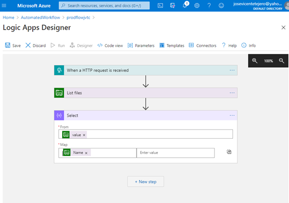

Task 4: Build an HTTP response action

1. In     the **Designer** area, select **+ New step**, and     then perform the following actions to add a **Response (Request)** action:

1. 1. In      the **Search connectors and triggers** field, enter **response**.
   2. In      the **Actions** result list, select **Response**.

2. In     the **Response** area, perform the following actions to     configure the **Response (Request)** action:

1. 1. In      the **Status Code** text box, enter **200**.
   2. On      the **Body** field, in the **Dynamic content** list,      within the **Select** category, select **Output**.

2. In     the **Designer** area, select **Save**.

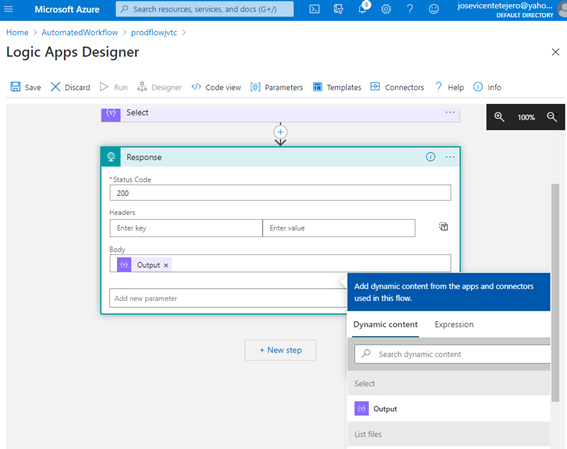

Review

In this exercise, you built a basic workflow that starts when it’s triggered by an HTTP GET request. It then queries a storage service, enumerates the results, and then returns those results as an HTTP response.

Exercise 3: Use Azure API Management as a proxy for Logic Apps

Task 1: Create an API integrated with Logic Apps

1. In the     Azure portal navigation pane, select **Resource groups**.
2. On     the **Resource groups** blade, select the **AutomatedWorkflow** resource     group that you created earlier in this lab.
3. On     the **AutomatedWorkflow** blade, select the **prodapim\*[yourname]\*** API     Management resource that you created earlier in this lab.
4. From     the **API Management Service** blade, in the **API     Management** section, select **APIs**.
5. In     the **Add a new API** section, select **Logic App**.
6. In     the **Create from Logic App** dialog box, perform the     following actions:

1. 1. Select **Full**.
   2. In      the **Logic App** section, select **Browse**.
   3. In      the **Select Logic App to import** dialog box, select      the **prodflow\*[yourname]\*** Logic App that you created      earlier in this lab, and then select **Select**.
   4. In      the **Display name** text box, enter **Metadata Lookup**.
   5. In      the **Name** text box, enter **metadata-lookup**.
   6. Leave      the **API URL suffix** text box empty.
   7. Select **Create**.

**Note**: Wait for the new API to finish being created.

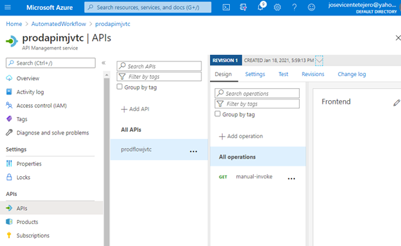

Task 2: Test the API operation

1. From     the **Design** tab, select **Test**.
2. On     the **Test** tab, perform the following actions:

1. 1. Select      the single **GET** operation.
   2. Copy      the value of the **Request URL** field. (You will use this      value later in the lab.)
   3. Select **Send**.
   4. In      the **HTTP response** section, observe the JSON results of      the test request.

2. Return     to your browser window with the Azure portal.

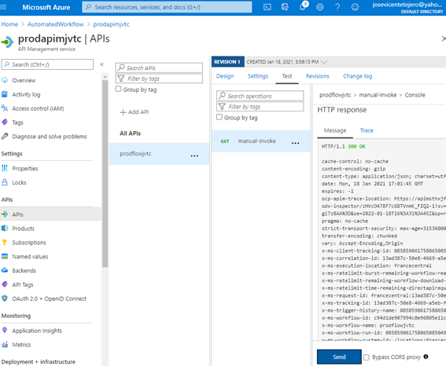

prodapimjvtc.azure-api.net

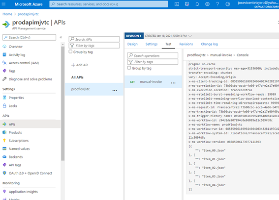

Review

In this exercise, you used Azure API Management as a proxy to trigger your Logic App workflow.

Exercise 4: Clean up your subscription

Task 1: Open Azure Cloud Shell and list resource groups

1. In     Azure portal, select the **Cloud Shell** icon to open a new     shell instance.

**Note**: The **Cloud Shell** icon is represented by a greater than sign (>) and underscore character (_).

1. If this     is your first time opening Cloud Shell using your subscription, you can     use the **Welcome to Azure Cloud Shell Wizard** to configure     Cloud Shell for first-time usage. Perform the following actions in the     wizard:

1. 1. A      dialog box prompts you to create a new storage account to begin using the      shell. Accept the default settings, and then select **Create      storage**.

**Note**: Wait for Cloud Shell to finish its initial setup procedures before moving forward with the lab. If you don’t notice the Cloud Shell configuration options, this is most likely because you’re using an existing subscription with this course’s labs. The labs are written with the presumption that you’re using a new subscription.

Task 2: Delete resource groups

1. Enter     the following command, and then select Enter to delete the **AutomatedWorkflow** resource     group:

CodeCopy

az group delete --name AutomatedWorkflow --no-wait --yes

1. Close     the Cloud Shell pane.

Task 3: Close the active applications

- Close     the currently running Microsoft Edge application.

Review

In this exercise, you cleaned up your subscription by removing the resource groups used in this lab.

 